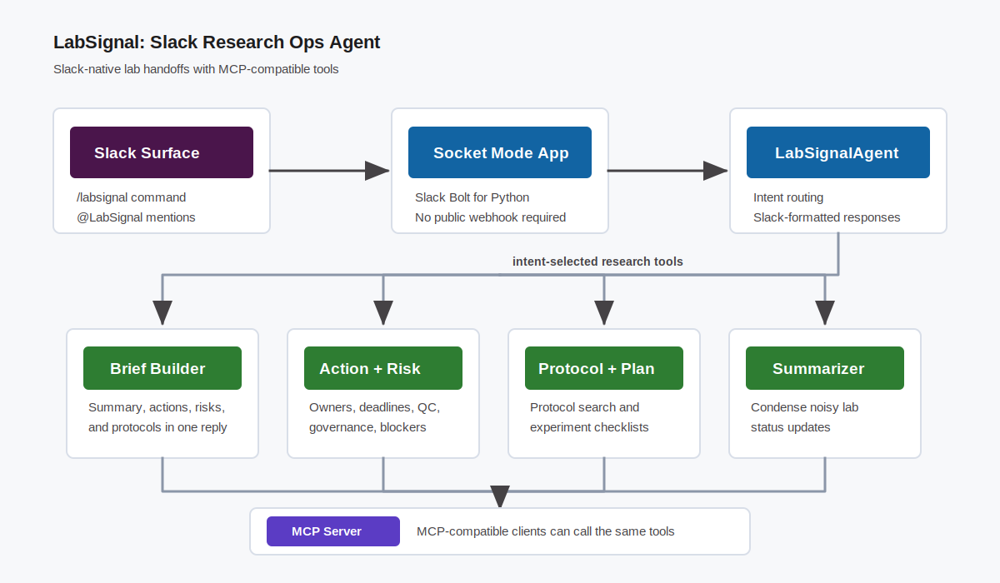

# LabSignal architecture

LabSignal has two layers: the Slack user surface and a reusable local tool layer
that is also exposed through MCP.

## Flow

1. A researcher uses `/labsignal` or mentions `@LabSignal` in Slack.
2. Slack sends the event to the local Socket Mode app.
3. `LabSignalAgent` routes the request by intent:
   - `brief` -> combined lab handoff
   - `actions` -> action item extraction
   - `risks` -> QC, schedule, governance, and reproducibility flags
   - `plan` -> experiment checklist
   - `protocol` -> neuroscience protocol search
   - `summarize` -> concise update summarization
4. The same tools are exposed by `mcp_server.py` for MCP-compatible clients.
5. The formatted answer is posted back into Slack.

## Required challenge technology

LabSignal uses **MCP server integration** through `src/labsignal/mcp_server.py`.
